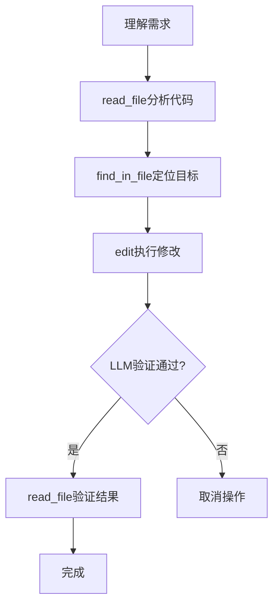

# 🚀 OpenVibe - AI Coding Assistant for VS Code
> **基于三个核心工具构建的智能项目编辑助手**

## ⚠️ 重要提示

当前项目可以完成智能编辑功能，但不推荐用于实际工作环境。然而，它的使用体验非常有趣和有感觉，因此得名OpenVibe。

整个项目的开发过程耗资30元巨款用于DeepSeek的API调用

## 📋 目录

- [⚠️ 重要提示](#⚠️-重要提示)
- [🎯 项目概述](#🎯-项目概述)
- [🎨 设计哲学](#🎨-设计哲学)
- [🔧 核心工具详解](#🔧-核心工具详解)
- [📚 其他可用工具](#📚-其他可用工具)
- [🔧 安装方法](#🔧-安装方法)
- [⚙️ 配置设置](#⚙️-配置设置)
- [🧠 内存管理系统](#🧠-内存管理系统)

## 🎯 项目概述

OpenVibe是一个直接在VS Code工作空间中读取和编辑文件的AI编程助手。
OpenVibe通过三个基本文件操作工具构建了完整的项目级编辑能力：

- **read** - 读取文件内容
- **find** - 定位代码位置  
- **edit** - 安全编辑代码

这三个工具形成了一套最小但完整的文件操作系统，支持从代码分析到精确修改的全流程。系统还包含任务规划、会话管理、配置管理等功能，实现智能的、可控的项目级代码编辑。

## 🎨 设计哲学：基于三个核心工具的项目编辑

OpenVibe的设计核心是**三个基本文件操作工具**的抽象。我们相信任何项目级别的代码编辑都可以分解为这三个基本操作：

1. **信息获取** (read) - 理解现有代码
2. **位置定位** (find) - 找到需要修改的地方
3. **安全修改** (edit) - 应用精确的变更

这种设计确保了：
- **最小化复杂性**：仅三个工具实现完整功能
- **最大化可控性**：每一步操作都可验证
- **项目级一致性**：保持代码库的整体协调

---

## 🔧 核心工具详解

### 📖 1. read_file - 读取文件内容

```javascript
read_file(filePath, startLine, endLine)
```

**用途**：获取文件的完整或部分内容，用于理解代码结构和上下文。

**特点**：
- 支持指定行范围读取，减少上下文开销
- 返回带行号的代码内容，便于精确引用
- 编辑前必读操作，确保理解准确

**工作流程**：
```
读取文件 → 理解结构 → 规划修改
```

### 🔍 2. find_in_file - 定位代码位置

```javascript
find_in_file(filePath, searchString, contextBefore, contextAfter)
```

**用途**：在文件中查找特定代码片段并返回其精确位置。

**特点**：
- 精确的字符串匹配（大小写敏感）
- 可配置上下文行数，获取周围代码
- 支持查找第N次出现（默认第一次）

**工作流程**：
```
定位目标代码 → 获取上下文 → 确定编辑位置
```

### ✏️ 3. edit - 安全编辑代码

```javascript
edit(filePath, startLine, endLine, newContent)
```

**用途**：替换文件中的特定代码区域，包含自动LLM验证。

**特点**：
- **二次LLM验证**：自动检查修改的正确性和安全性
- **精确行数控制**：替换指定行范围的代码
- **插入/删除支持**：支持纯插入（endLine = startLine - 1）和删除（newContent = ""）
- **失败回滚**：验证失败时自动取消操作

**工作流程**：
```
执行编辑 → LLM验证 → 应用变更（或取消）
```

### 核心工具协作流程

典型的项目编辑任务遵循以下模式：



---
## 📚 其他可用工具

除了三个核心文件操作工具外，OpenVibe还提供以下辅助工具：

### create_todo_list - 任务规划工具

用于多步骤任务的规划和管理。遵循"先计划后执行"的原则，确保复杂任务的有序完成。

**特点**：
- 任务分解为明确步骤
- 支持子任务扩展（expandIndex功能）
- 完成状态跟踪

### get_workspace_info - 工作空间信息

获取当前工作空间的根目录和顶层文件列表，用于了解项目结构。

### create_directory - 创建目录

在项目结构中创建新目录，支持递归创建。

### complete_todo_item - 任务进度跟踪

标记todo项目为已完成，更新任务进度。

### compact - 会话压缩工具

将长对话历史压缩为简洁摘要，减少上下文窗口使用。

## 🔧 安装方法

### 安装步骤

1. **下载扩展**：
   ```bash
   # 克隆项目
   git clone https://github.com/DoubtedSteam/openvibe.git
   cd openvibe
   ```

2. **安装依赖**：
   ```bash
   npm install
   ```

3. **构建扩展**：
   ```bash
   npm run compile
   ```

4. **安装到VS Code**：
   - 按 `F1` 打开命令面板
   - 输入 `Extensions: Install from VSIX`
   - 选择 `openvibe/vibe-coding-assistant-0.0.1.vsix`

## ⚙️ 配置设置

OpenVibe提供灵活的配置选项，可通过VS Code设置界面进行配置。

### 配置方式

1. **通过VS Code设置界面**：
   - 按 `Ctrl+,` 打开设置
   - 搜索 "Vibe Coding Assistant"
   - 配置相关选项

2. **通过settings.json文件**：
   ```json
    {
      "vibe-coding.apiBaseUrl": "https://api.deepseek.com",
      "vibe-coding.apiKey": "your-api-key",
      "vibe-coding.model": "deepseek-reasoner",
      "vibe-coding.confirmChanges": true,
      "vibe-coding.maxInteractions": -1,
      "vibe-coding.maxSequenceLength": 1000000
    }
   ```

### ⚙️ 配置选项说明

| 配置项 | 类型 | 默认值 | 说明 |
|--------|------|--------|------|
| **apiBaseUrl** | `string` | `https://api.deepseek.com` | OpenAI兼容API的基础URL |
| **apiKey** | `string` | `""` | API密钥（**必填**） |
| **model** | `string` | `deepseek-reasoner` | 使用的AI模型 |
| **confirmChanges** | `boolean` | `true` | 文件修改前是否需要用户确认 |
| **maxInteractions** | `number` | `-1` | 最大工具调用迭代次数（`-1`表示无限制） |
| **maxSequenceLength** | `number` | `1000000` | 生成文本的最大长度 |

## 🧠 内存管理系统

OpenVibe包含一个智能内存系统，用于维护项目知识和任务历史。

### 内存文件结构

内存文件位于 `.OpenVibe/memory.md`，包含以下部分：

1. **项目概览** - 项目基本信息
2. **重要文件说明** - 关键文件功能介绍
3. **技术栈** - 使用的技术和框架
4. **会话历史摘要** - 重要任务的记录
5. **待办事项** - 当前的任务列表
6. **开发笔记** - 技术细节和注意事项

### 内存使用原则

1. **主动规划**：内存更新应作为todo list的一部分
2. **持续积累**：重要修改及时记录到内存
3. **知识传承**：为新会话提供项目上下文
4. **一致性维护**：确保项目知识的连续性

## 📄 许可证

MIT License - 详见LICENSE文件

---

**OpenVibe - 基于三个核心工具构建的智能项目编辑助手**

*简洁、可控、强大的AI辅助编程体验*